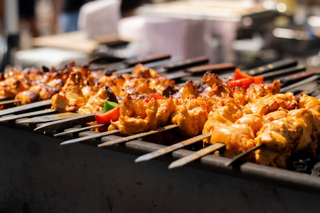

our first markdown file 
# Heading 1
## HEading 2
### heading 3 - sub section
#### heading 4 -sub section

This is a normal text

**This is a bold text** (bold the letters)

*This is a italic text* (ittalic )

~~This is the completed text~~

**This is the molud *how***

[](https://ollama.com/library/llama3.2:1b)


## cafes in vadodara

- The Brewery[^1]
    1. chicken leg piece
        - half piece
        - full leg piece
    2. chicken tikka
    3. handi chicken
    4. handi mutton
- Koa cafe
- cleo's coffe and more
- Artistary Cafe

## Dinner Menu

1. Chicken tikka 
    - green chicken 
    - only curry
    - red curry 
    - bone less piece
2. Masla fry egg 
3. Malsa fry egg curry
4. Fish fry

## Conversion Chart

|Sr no | From | To | Conversion |
|------:|------:|----:|-----:|
|1|**USD** | [**INR**](https://en.wikipedia.org/wiki/Exchange_rate_history_of_the_Indian_rupee) | RS 68.6
|2|**EUR** | [**INR**](https://en.wikipedia.org/wiki/Exchange_rate_history_of_the_Indian_rupee) | Rs 78.5

# Code Blocks

`Tutorial`

```py
for i in range(10):
    print(i+10)

```

> This is a work inspired from him

made with 😊❤️❤️❤️

- [ ] item 1
- [x] item 2
- [ ] item 3

- [^1]: This is a sample node


